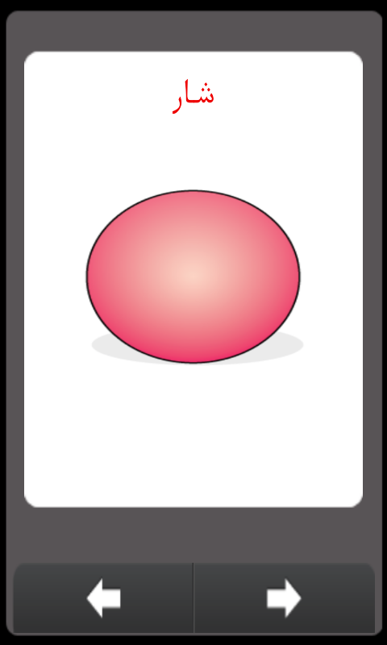

Shapes
======

Shapes for kids. Android App.
A small app that teaches kids to recogize shapes and their names.

بالىلار ئۈچۈن تۈزۈلگەن ئۇچرايدىغان گېئومېتىرىيەلىك شەكىللەرنى، شەكىلنىڭ نامى، ئوقۇلىشى قاتارلىقلارنى تونۇشىغا ياردەم بېرىدىغان ئەپ.

Screenshots
---------

Download Link
---------
* [Download from Bilkan Bazar](http://bazar.bilkan.net/App.aspx?id=52)

Similar Projects
---------
* [Four Operators](https://github.com/Bilkan/FourOperators)
* [Numbers](https://github.com/Bilkan/Numbers)
* [Plants](https://github.com/Bilkan/Plants)
* [Colors](https://github.com/Bilkan/Colors)
* [Compare](https://github.com/Bilkan/Compare)
